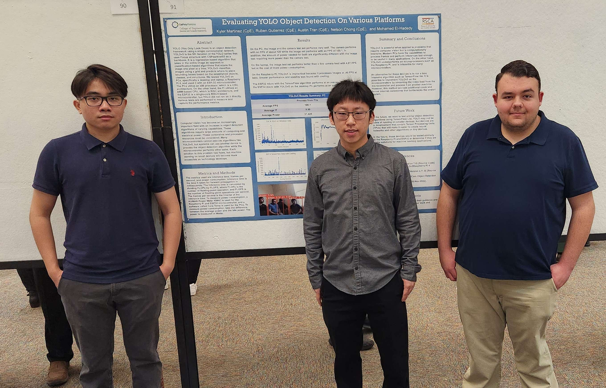

# Evaluating Object Detection For Various Platforms

Evaluating Object Detection For Various Platforms was a research project that investigated YOLOv5's performance on different platforms and architectures. The devices tested were a desktop PC, laptop PC, and a Raspberry Pi 4. The ESPCAM32 and ESP32 were used to test object detection on the microcontroller level.

Our findings were presented on March 4th, 2023 at the 2023 RSCA conference at Cal Poly Pomona.

Members: Kyler Martinez, Ruben Gutierrez, Austin Vinh Tran, and Nelson Chong

Poster:

Picture at RSCA:

